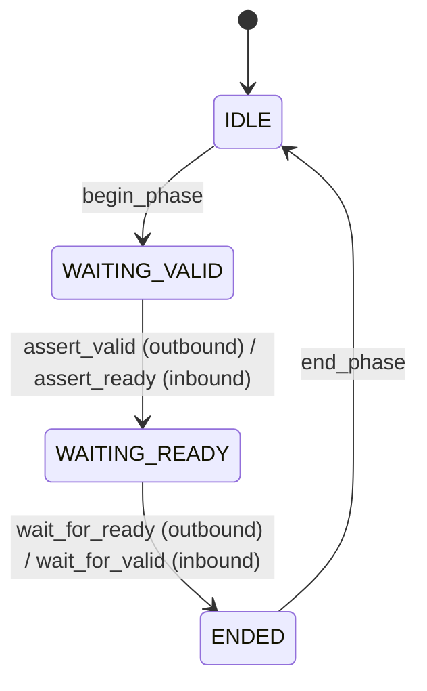

# Channel API

NI exposes channel-API methods at two granularities:
- **Per-AXI-channel** (AW / W / B / AR / R) for fine-grained control of AXI4 host-side handshakes
- **Per-NoC-link** (REQ / RSP) for fine-grained control of NoC flit injection / reception

## When to use this API

Use Channel API when:
- Driving `awready` / `wready` / `arready` without an accompanying matching response (back-pressure recovery).
- Holding `noc_req_o.ready` LOW for extended cycles to test router timeout behavior on the upstream side.
- Injecting illegal handshake sequences (e.g., assert `noc_*_o.valid` with malformed flit_data; assert `bvalid` before any AW handshake).
- Driving per-cycle deterministic patterns (vs. random delays via `set_response_delay_axi` / `set_response_delay_noc`).

Otherwise use `transaction_api.md`.

## API conventions

- **Per-AXI-channel** methods named `<verb>_<channel>` — e.g. `begin_phase_AW`, `assert_valid_AW`, `wait_for_ready_AW`, `end_phase_AW`.
- **Per-NoC-link** methods named `<verb>_<link_direction>` — e.g. `begin_phase_NOC_REQ_OUT`, `assert_valid_NOC_REQ_OUT`, `wait_for_ready_NOC_REQ_OUT`, `end_phase_NOC_REQ_OUT`. Direction suffix `_OUT` for BFM-driven, `_IN` for BFM-observed.
- Naming: snake_case.
- Error reporting: `status_t` enum; per-channel methods return `OK`, `ILLEGAL_PHASE`, `BUSY_TXN_API`, or `RESET_DURING_TRANSACTION`.
- Blocking discipline: only `wait_for_*` methods block.

## Channel state machine (AXI side)

Used by all 5 AXI4 channels (AW, W, B, AR, R). For each channel the BFM either drives VALID and waits for READY (outbound) or drives READY and waits for VALID (inbound), depending on which port (manager `axi_in_*` or subordinate `axi_out_*`) and which channel.

## Channel state machine (NoC side)

NoC links use the same valid/ready handshake state machine. Each link direction (`noc_req_o`, `noc_req_i`, `noc_rsp_o`, `noc_rsp_i`) has its own instance.

## Per-AXI-channel API

### AW channel — manager port (`axi_in_req_i.aw*`; inbound to BFM)

| Method | Signature | Legal in state | Side effect | Returns |
|--------|-----------|----------------|-------------|---------|
| `begin_phase_AW_IN()` | void | IDLE | Transition to WAITING_VALID. No wires driven (AW is inbound from AXI master DUT). | OK or BUSY_TXN_API |
| `assert_ready_AW_IN()` | void | WAITING_VALID | `axi_in_rsp_o.awready` driven HIGH on next aclk edge. State → WAITING_READY. | OK or ILLEGAL_PHASE |
| `wait_for_valid_AW_IN(addr_match=<opt>, id_match=<opt>)` | (status, addr, id, len, ...) | WAITING_READY | Blocks until `axi_in_req_i.awvalid` observed HIGH on aclk rising edge. State → ENDED. | OK or RESET_DURING_TRANSACTION |
| `end_phase_AW_IN()` | void | ENDED | `axi_in_rsp_o.awready` driven LOW. State → IDLE. | OK or ILLEGAL_PHASE |

### AW channel — subordinate port (`axi_out_req_o.aw*`; outbound from BFM)

| Method | Signature | Legal in state | Side effect | Returns |
|--------|-----------|----------------|-------------|---------|
| `begin_phase_AW_OUT(addr, id, len, size, burst, prot, qos, ...)` | void(...) | IDLE | Payload fields driven on next aclk edge. `awvalid` remains LOW. | OK or BUSY_TXN_API |
| `assert_valid_AW_OUT()` | void | WAITING_VALID | `axi_out_req_o.awvalid` driven HIGH. State → WAITING_READY. | OK or ILLEGAL_PHASE |
| `wait_for_ready_AW_OUT()` | status_t | WAITING_READY | Blocks until `axi_out_rsp_i.awready` observed HIGH. State → ENDED. | OK or RESET_DURING_TRANSACTION |
| `end_phase_AW_OUT()` | void | ENDED | `awvalid` driven LOW. State → IDLE. | OK or ILLEGAL_PHASE |

### W channel — manager port (`axi_in_req_i.w*`; inbound to BFM)

| Method | Signature | Legal in state | Side effect | Returns |
|--------|-----------|----------------|-------------|---------|
| `begin_phase_W_IN()` | void | IDLE | Transition to WAITING_VALID. No wires driven. | OK or BUSY_TXN_API |
| `assert_ready_W_IN()` | void | WAITING_VALID | `axi_in_rsp_o.wready` driven HIGH. State → WAITING_READY. | OK or ILLEGAL_PHASE |
| `wait_for_valid_W_IN(last_match=<opt>)` | (status, data, strb, last) | WAITING_READY | Blocks until `axi_in_req_i.wvalid` HIGH. If `last_match=1`, additionally requires wlast=1. Returns observed (wdata, wstrb, wlast). State → ENDED. | OK or RESET_DURING_TRANSACTION |
| `end_phase_W_IN()` | void | ENDED | `wready` driven LOW. State → IDLE. | OK or ILLEGAL_PHASE |

### W channel — subordinate port (`axi_out_req_o.w*`; outbound from BFM)

| Method | Signature | Legal in state | Side effect | Returns |
|--------|-----------|----------------|-------------|---------|
| `begin_phase_W_OUT(data, strb, last)` | void(uint64_t, uint8_t, bit) | IDLE | wdata, wstrb, wlast driven on next aclk edge. wvalid remains LOW. State → WAITING_VALID. | OK or BUSY_TXN_API |
| `assert_valid_W_OUT()` | void | WAITING_VALID | `axi_out_req_o.wvalid` driven HIGH. State → WAITING_READY. | OK or ILLEGAL_PHASE |
| `wait_for_ready_W_OUT()` | status_t | WAITING_READY | Blocks until `axi_out_rsp_i.wready` HIGH. State → ENDED. | OK or RESET_DURING_TRANSACTION |
| `end_phase_W_OUT()` | void | ENDED | wvalid driven LOW; wlast deasserted. State → IDLE. | OK or ILLEGAL_PHASE |

### B channel — manager port (`axi_in_rsp_o.b*`; outbound from BFM)

| Method | Signature | Legal in state | Side effect | Returns |
|--------|-----------|----------------|-------------|---------|
| `begin_phase_B_IN(bresp, bid)` | void(uint2_t, uint_id_width_t) | IDLE | bresp, bid driven on next aclk edge. bvalid remains LOW. State → WAITING_VALID. | OK or BUSY_TXN_API |
| `assert_valid_B_IN()` | void | WAITING_VALID | `axi_in_rsp_o.bvalid` driven HIGH. State → WAITING_READY. | OK or ILLEGAL_PHASE |
| `wait_for_ready_B_IN()` | status_t | WAITING_READY | Blocks until `axi_in_req_i.bready` HIGH. State → ENDED. | OK or RESET_DURING_TRANSACTION |
| `end_phase_B_IN()` | void | ENDED | bvalid driven LOW. State → IDLE. | OK or ILLEGAL_PHASE |

### B channel — subordinate port (`axi_out_rsp_i.b*`; inbound to BFM)

| Method | Signature | Legal in state | Side effect | Returns |
|--------|-----------|----------------|-------------|---------|
| `begin_phase_B_OUT()` | void | IDLE | Transition to WAITING_VALID. No wires driven. | OK or BUSY_TXN_API |
| `assert_ready_B_OUT()` | void | WAITING_VALID | `axi_out_req_o.bready` driven HIGH. State → WAITING_READY. | OK or ILLEGAL_PHASE |
| `wait_for_valid_B_OUT(id_match=<opt>)` | (status, bresp, bid) | WAITING_READY | Blocks until `axi_out_rsp_i.bvalid` HIGH; optionally requires bid=id_match. Returns (bresp, bid). State → ENDED. | OK or RESET_DURING_TRANSACTION |
| `end_phase_B_OUT()` | void | ENDED | bready driven LOW. State → IDLE. | OK or ILLEGAL_PHASE |

### AR channel — manager port (`axi_in_req_i.ar*`; inbound to BFM)

| Method | Signature | Legal in state | Side effect | Returns |
|--------|-----------|----------------|-------------|---------|
| `begin_phase_AR_IN()` | void | IDLE | Transition to WAITING_VALID. No wires driven. | OK or BUSY_TXN_API |
| `assert_ready_AR_IN()` | void | WAITING_VALID | `axi_in_rsp_o.arready` driven HIGH. State → WAITING_READY. | OK or ILLEGAL_PHASE |
| `wait_for_valid_AR_IN(addr_match=<opt>, id_match=<opt>)` | (status, addr, id, len, size, burst, prot, qos) | WAITING_READY | Blocks until `axi_in_req_i.arvalid` HIGH. Returns observed AR fields. State → ENDED. | OK or RESET_DURING_TRANSACTION |
| `end_phase_AR_IN()` | void | ENDED | arready driven LOW. State → IDLE. | OK or ILLEGAL_PHASE |

### AR channel — subordinate port (outbound from BFM)

Mirror of AR_IN: `begin_phase_AR_OUT(addr, id, len, size, burst, prot, qos)` → `assert_valid_AR_OUT` → `wait_for_ready_AR_OUT` → `end_phase_AR_OUT`. Drives `axi_out_req_o.ar*` outputs.

### R channel — manager port (`axi_in_rsp_o.r*`; outbound from BFM)

| Method | Signature | Legal in state | Side effect | Returns |
|--------|-----------|----------------|-------------|---------|
| `begin_phase_R_IN(rdata, rresp, rlast, rid)` | void(uint_data_width_t, uint2_t, bit, uint_id_width_t) | IDLE | rdata, rresp, rlast, rid driven on next aclk edge. rvalid remains LOW. State → WAITING_VALID. | OK or BUSY_TXN_API |
| `assert_valid_R_IN()` | void | WAITING_VALID | `axi_in_rsp_o.rvalid` driven HIGH. State → WAITING_READY. | OK or ILLEGAL_PHASE |
| `wait_for_ready_R_IN()` | status_t | WAITING_READY | Blocks until `axi_in_req_i.rready` HIGH. State → ENDED. | OK or RESET_DURING_TRANSACTION |
| `end_phase_R_IN()` | void | ENDED | rvalid driven LOW; rlast deasserted. State → IDLE. | OK or ILLEGAL_PHASE |

### R channel — subordinate port (inbound to BFM)

Mirror of R_IN: `begin_phase_R_OUT()` → `assert_ready_R_OUT` → `wait_for_valid_R_OUT(id_match)` → `end_phase_R_OUT`. Returns observed (rdata, rresp, rlast, rid).

### CSR access channels (AXI4-Lite subordinate; csr_*)

The CSR port has 5 standard AXI4-Lite channels (csr_aw / csr_w / csr_b / csr_ar / csr_r). Channel API methods follow the same shape as AXI4 channels but with no AWLEN / AWSIZE / AWBURST / AWID fields (AXI4-Lite is single-beat, no ID).

Methods (compact summary; full tables follow same shape as above):

- `begin_phase_CSR_AW(addr)` / `assert_ready_CSR_AW` / `wait_for_valid_CSR_AW` / `end_phase_CSR_AW`
- `begin_phase_CSR_W(data, strb)` / `assert_ready_CSR_W` / `wait_for_valid_CSR_W` / `end_phase_CSR_W`
- `begin_phase_CSR_B(bresp)` / `assert_valid_CSR_B` / `wait_for_ready_CSR_B` / `end_phase_CSR_B`
- `begin_phase_CSR_AR(addr)` / `assert_ready_CSR_AR` / `wait_for_valid_CSR_AR` / `end_phase_CSR_AR`
- `begin_phase_CSR_R(rdata, rresp)` / `assert_valid_CSR_R` / `wait_for_ready_CSR_R` / `end_phase_CSR_R`

Direction convention: BFM (NI subordinate) drives ready signals on inbound channels (AW/W/AR) and valid signals on outbound channels (B/R). All payload signals are sized per AXI4-Lite (32-bit data, 12-bit address per registers.md, 4-bit strobe).

## Per-NoC-link API

### Request link, outbound (NMU injecting AW/W/AR flits)

| Method | Signature | Legal in state | Side effect | Returns |
|--------|-----------|----------------|-------------|---------|
| `begin_phase_NOC_REQ_OUT(flit_data)` | void(flit_t) | IDLE | `noc_req_o.flit_data` driven on next noc_clk edge. `noc_req_o.valid` remains LOW. State → WAITING_VALID. | OK or BUSY_TXN_API |
| `assert_valid_NOC_REQ_OUT()` | void | WAITING_VALID | `noc_req_o.valid` driven HIGH. State → WAITING_READY. | OK or ILLEGAL_PHASE |
| `wait_for_ready_NOC_REQ_OUT()` | status_t | WAITING_READY | Blocks until router asserts `noc_req_o.ready` HIGH. State → ENDED. | OK or RESET_DURING_TRANSACTION |
| `end_phase_NOC_REQ_OUT()` | void | ENDED | `noc_req_o.valid` driven LOW. State → IDLE. | OK or ILLEGAL_PHASE |

### Request link, inbound (NSU receiving AW/W/AR flits)

| Method | Signature | Legal in state | Side effect | Returns |
|--------|-----------|----------------|-------------|---------|
| `begin_phase_NOC_REQ_IN()` | void | IDLE | Transition to WAITING_VALID. No wires driven. | OK or BUSY_TXN_API |
| `assert_ready_NOC_REQ_IN()` | void | WAITING_VALID | `noc_req_i.ready` driven HIGH on next noc_clk edge. State → WAITING_READY. | OK or ILLEGAL_PHASE |
| `wait_for_valid_NOC_REQ_IN()` | (status, flit_data) | WAITING_READY | Blocks until `noc_req_i.valid` observed HIGH. Returns observed flit. State → ENDED. | OK or RESET_DURING_TRANSACTION |
| `end_phase_NOC_REQ_IN()` | void | ENDED | `noc_req_i.ready` driven LOW. State → IDLE. | OK or ILLEGAL_PHASE |

### Response link, outbound (NSU injecting B/R flits)

| Method | Signature | Legal in state | Side effect | Returns |
|--------|-----------|----------------|-------------|---------|
| `begin_phase_NOC_RSP_OUT(flit_data)` | void(flit_t) | IDLE | `noc_rsp_o.flit_data` driven on next noc_clk edge. `noc_rsp_o.valid` remains LOW. State → WAITING_VALID. | OK or BUSY_TXN_API |
| `assert_valid_NOC_RSP_OUT()` | void | WAITING_VALID | `noc_rsp_o.valid` driven HIGH. State → WAITING_READY. | OK or ILLEGAL_PHASE |
| `wait_for_ready_NOC_RSP_OUT()` | status_t | WAITING_READY | Blocks until router asserts `noc_rsp_o.ready` HIGH. State → ENDED. | OK or RESET_DURING_TRANSACTION |
| `end_phase_NOC_RSP_OUT()` | void | ENDED | `noc_rsp_o.valid` driven LOW. State → IDLE. | OK or ILLEGAL_PHASE |

### Response link, inbound (NMU receiving B/R flits)

| Method | Signature | Legal in state | Side effect | Returns |
|--------|-----------|----------------|-------------|---------|
| `begin_phase_NOC_RSP_IN()` | void | IDLE | Transition to WAITING_VALID. No wires driven. | OK or BUSY_TXN_API |
| `assert_ready_NOC_RSP_IN()` | void | WAITING_VALID | `noc_rsp_i.ready` driven HIGH on next noc_clk edge. State → WAITING_READY. | OK or ILLEGAL_PHASE |
| `wait_for_valid_NOC_RSP_IN(rob_idx_match=<opt>)` | (status, flit_data) | WAITING_READY | Blocks until `noc_rsp_i.valid` observed HIGH. Optionally filters by flit header `rob_idx`. Returns observed flit. State → ENDED. | OK or RESET_DURING_TRANSACTION |
| `end_phase_NOC_RSP_IN()` | void | ENDED | `noc_rsp_i.ready` driven LOW. State → IDLE. | OK or ILLEGAL_PHASE |

## Ordering constraints with Transaction API

- **Forbidden**: any Channel API method while a Transaction API call holds the same channel / link. Transaction API ownership flows from the transaction lifecycle (`apply_axi_write` owns AW + W + B; `apply_axi_read` owns AR + R; both hold corresponding NoC link directions). Channel API on those held channels returns `BUSY_TXN_API`.
- **Permitted**: Channel API on AXI subordinate port while Transaction API on manager port (different channels). Channel API on NoC inbound while Transaction API on NoC outbound (different link directions).
- **Detection**: BFM tracks per-channel ownership; methods check before driving.

## Behavior under reset

Either reset asserts → channel state machines in that domain reset to IDLE → blocked `wait_for_*` calls unblock with `RESET_DURING_TRANSACTION` → outstanding `begin_phase_*` field configurations dropped → on reset deassertion, channels are clean and ready.

## Concurrency rules

- Per-channel methods on different channels may be called concurrently from separate threads.
- Per-channel methods on the same channel must be called from a single thread; BFM does not arbitrate.
