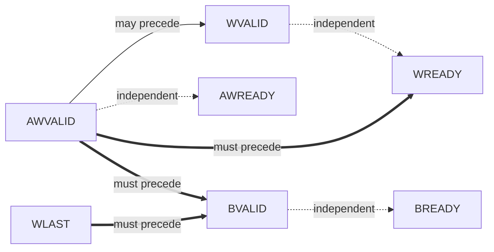
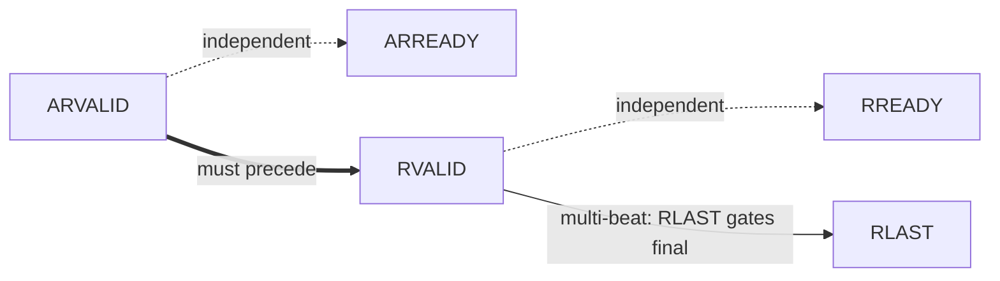
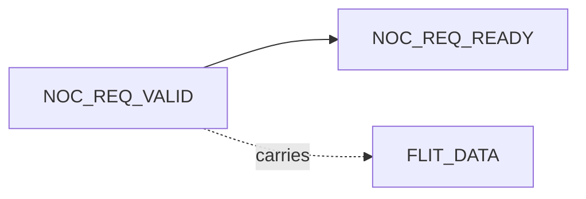
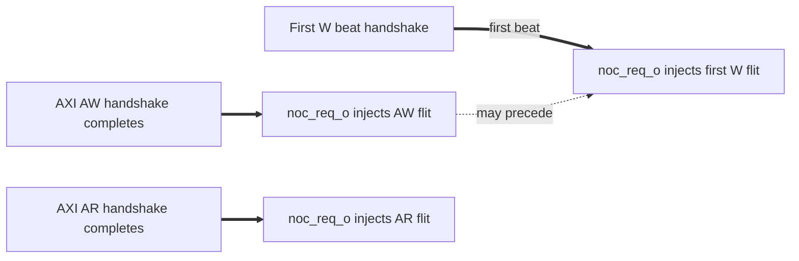

# Channel Handshake & Dependencies

The NI bridges two protocols. Handshake / dependency analysis is split:
- AXI4 host side: standard 5-channel valid/ready dependencies (per ARM AMBA AXI Specification §A3.3)
- NoC side: simpler 2-link valid/ready handshake (per noc_*_o / noc_*_i pairs)
- Cross-protocol: AXI ↔ flit transformation ordering inside NMU and NSU

## Arrow convention

Per ARM AMBA AXI Specification §A3.3 (reuse for all valid/ready handshake protocols here):
- `A --> B`: source A *may* assert before destination B (permissive)
- `A ==> B`: source A *must* assert before destination B (mandatory; reversal is a violation, has corresponding `XCH` rule in `protocol_rules.md`)

## AXI4 host-side dependencies

### Write transaction (AW + W → B)

#### Dependency diagram

#### Textual dependency list

- AWVALID assertion may precede WVALID assertion (write address may issue before, simultaneous with, or after data).
- AWVALID assertion may precede or follow AWREADY (both VALID-before-READY and READY-before-VALID are legal).
- WVALID assertion may precede or follow WREADY (same).
- AWVALID handshake must precede WREADY for the corresponding write — NSU does not accept W phase before AW phase. Rule: `AXI4_SLV_XCH_W_AFTER_AW`.
- AWVALID handshake must precede BVALID. Rule: `AXI4_SLV_XCH_B_AFTER_AW_AND_W`.
- WLAST observation must precede BVALID (slave cannot respond before all write data has arrived). Rule: `AXI4_SLV_XCH_B_AFTER_AW_AND_W`.
- BVALID may precede or follow BREADY.

#### Deadlock-avoidance commentary

NMU and NSU each register all VALID and READY outputs. No combinational path between an inbound VALID and the same NI's outbound READY. WREADY is held LOW only until the corresponding AW phase completes; WREADY is **not** chained on BREADY — NMU does not gate WREADY on BREADY observation.

The NMU's RoB enforces single-outstanding-per-AXI-ID semantics on the master side; NSU enforces ordering on the slave side via ReqInfoStore. See `theory_of_operation.md` §RoB.

### Read transaction (AR → R)

#### Dependency diagram

#### Textual dependency list

- ARVALID assertion may precede or follow ARREADY.
- ARVALID handshake must precede RVALID. Rule: `AXI4_SLV_XCH_R_AFTER_AR`.
- For multi-beat reads (ARLEN > 0), all R beats must follow the AR handshake; the final R beat carries `RLAST = 1`. Rule: `AXI4_SLV_XCH_R_LAST_CONSISTENT`.
- RVALID may precede or follow RREADY.

#### Deadlock-avoidance commentary

ARREADY is registered. R burst is wormhole — once started, NMU drives R-beat sequence with RLAST gating the burst end; routers lock the path until RLAST.

## NoC side dependencies

### Request link (noc_req_*)

#### Dependency diagram

#### Textual dependency list

- `noc_req_o.valid` rises → must remain HIGH until `noc_req_o.ready` (back-from-router) is observed HIGH (= flit accepted).
- `noc_req_o.flit_data[FLIT_WIDTH-1:0]` must be stable while `valid` is HIGH (per `NOC_MST_FLIT_STABLE` rule).
- `noc_req_o.ready` and `noc_req_o.valid` are independent — router may have ready HIGH continuously; NI may have valid HIGH continuously.

### Response link (noc_rsp_*)

Mirror of Request link.

### Cross-link

Request and response links are **independent**. A request flit may be in flight on `noc_req_o` while a response flit arrives on `noc_rsp_i` simultaneously (both directions concurrently). No NI-level ordering between request and response links beyond the per-transaction logical correspondence (a request issued generates an eventual matching response).

## Cross-protocol (AXI ↔ flit) transformation ordering

These rules govern the NI internal ordering between AXI handshakes and flit injections / receptions.

### NMU forward path: AXI request → NoC request flit

- AXI AW handshake must precede the corresponding AW flit injection (NMU pulls the address from the handshake before packing the flit).
- W flit injection may interleave with AW flit injection in time on `noc_req_o` (both go on same link); ordering between AW and W flits at the NMU output is FIFO-natural.
- TODO(designer): formal NMU AR-during-W ordering guarantee (no issue yet — confirmed via theory_of_operation.md §"AR-during-W ordering" Reviewer-assumption decision: AR flits MAY interleave with W burst beats on the same `noc_req_o` link, with W reassembly handled at NSU; rationale = head-of-line blocking avoidance). Default assumption: yes (AR is single-flit and goes before/between W beats per arbiter).

### NSU forward path: NoC request flit → AXI request

- NoC `noc_req_i` AW flit reception → reconstructs AW phase → drives `axi_out_req_o.aw*` and `axi_out_req_o.awvalid` per AXI4 channel rules.
- NoC `noc_req_i` W flit reception → adds beat to W reassembly buffer → when last beat received, drives W phase to `axi_out_req_o.w*`.
- Ordering: AW flit must arrive before any matching W flit (FIFO-natural at injection); NSU enforces W-after-AW via XCH rule.

### NMU return path: NoC response flit → AXI response

- NoC `noc_rsp_i` B flit reception → updates RoB entry → per-AXI-ID order release → drives `axi_in_rsp_o.b*` and `bvalid`.
- NoC `noc_rsp_i` R flit reception → accumulates rdata beats; final beat (RLAST in flit) → RoB release → drives `axi_in_rsp_o.r*` per beat.

### NSU return path: AXI response → NoC response flit

- `axi_out_rsp_i.bvalid` handshake → ECC generated (B has no data; ECC field unused) → `noc_rsp_o` B flit injection. NSU populates `qos` from `ReqInfoStore`.
- `axi_out_rsp_i.rvalid` handshake (per beat) → ECC generated over `rdata` → R flit injected per beat → final beat carries `rlast=1` flag in flit header.

## Out-of-order completion

- **AXI host side**: per-AXI-ID ordering is preserved by NMU's RoB. Different AXI IDs may complete out of order. NSU completes locally in issue order (single-port AXI slave assumption).
- **NoC side**: routers preserve flit order along same source / destination route within same `qos`; flits with different routes or different `qos` may interleave / overtake.
- **Cross-protocol**: flit reception order from `noc_rsp_i` may not match request injection order at `noc_req_o` (RoB reorders into AXI per-ID order). The RoB is the gatekeeper.

TODO(designer): cross-link to router-spec ordering rules once router DV plan is published (no issue yet — router spec is a separate IP under different ownership; QoS-aware arbitration with wormhole no-preemption per source-doc 06_qos.md §5 is the working model). Source-doc 06_qos.md §5 hints at QoS-aware arbitration with wormhole no-preemption.
