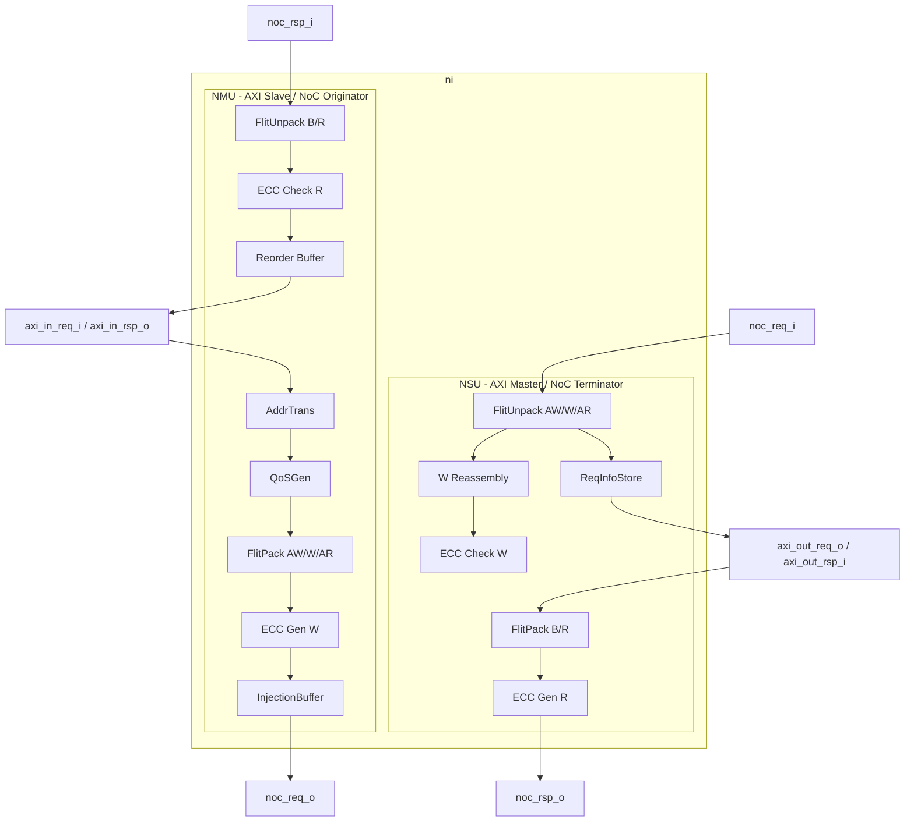

# Theory of Operation

## Block Diagram

`ni` has three top-level regions visible from the AXI/NoC boundaries:

- **NMU (Network Master Unit)** — accepts AXI requests from a connected master, packs them into request flits with NoC headers, and drives `noc_req_o`. On the response side it consumes flits from `noc_rsp_i`, reorders them through the RoB, and emits AXI B/R back to the master.
- **NSU (Network Slave Unit)** — accepts request flits from `noc_req_i`, reassembles AXI bursts (W channel) and reconstructs request headers, and drives an attached AXI slave on `axi_out_*`. On the response side it packs the slave's B/R replies into flits and emits them on `noc_rsp_o`.
- **Shared parameters & control** — `id_i` and `route_table_i` (used during routing decisions) are common to both units.

NMU and NSU can be enabled independently via `NI_CFG.EN_MGR_PORT` / `NI_CFG.EN_SBR_PORT`. A typical "endpoint" has both enabled.
<!-- source: 04_network_interface.md §2 -->

## Datapath

The end-to-end datapath, traced one direction at a time:

### NMU request path (AXI master → NoC)

1. AXI request arrives on `axi_in_req_i` (one of AW/W/AR channels).
2. **AddrTrans** consults `id_i` and either the XY-offset decoder (when `ROUTE_CFG.USE_ID_TABLE = 0`) or the SAM table (when `USE_ID_TABLE = 1`) to compute `dst_id` and `local_addr`. With XY-direct decoding and default offsets `XY_ADDR_OFFSET_X = 32` / `XY_ADDR_OFFSET_Y = 36`, `dst_x = addr[35:32]` and `dst_y = addr[39:36]`; the remainder `addr[31:0]` becomes the local-side address presented to the destination NSU.
3. **QoSGen** computes the header `qos` value according to `QOS_MODE` (Bypass / Fixed / Limiter / Regulator). For W flits the value is **inherited** from the corresponding AW; QoSGen does not run again per beat.
4. **FlitPack** assembles a flit per the bit allocation in `02_flit.md`. AW and AR are single-flit packets (`last = 1`). W is multi-flit: one flit per AXI beat; only the final beat sets `last = 1`. The header `rob_idx` is allocated by RoB before injection.
5. **ECC Gen** computes a 32-bit SECDED ECC over `wdata` (per 64-bit granule, 8 ECC bits each → 4 × 8 = 32). The ECC is placed in the `wecc` payload field. Headers and metadata are not protected — header integrity is the responsibility of the physical link layer.
6. **InjectionBuffer** absorbs handshake delay between FlitPack and the connected Router. Depth is `NMU_BUFFER_DEPTH` (configurable; default 2 in the C++ model).
7. The flit is driven onto `noc_req_o` (a `valid`/`ready`/`flit` triplet).

### NMU response path (NoC → AXI master)

1. Flits arrive on `noc_rsp_i`. The slave-port-style handshake is again `valid`/`ready`/`flit`.
2. **FlitUnpack** decomposes the response payload (B or R) per `02_flit.md` §3.3 / §3.4.
3. **ECC Check** validates `recc` against `rdata` per granule. Single-bit errors are corrected silently (logged in `ECC_UNCORR_ERR_CNT` is **not** incremented; per-granule correctable counts are not exposed in the current CSR map). Two-bit-uncorrectable errors set `ecc_fail = 1` for B responses (carried in `bresp = SLVERR`) and propagate `rresp = SLVERR` for R responses, also incrementing `ECC_UNCORR_ERR_CNT`.
4. **RoB** locates the entry corresponding to `rob_idx` in the flit header. R responses accumulate beats until the flit with `last = 1` arrives. The entry transitions to `READY_TO_RELEASE`.
5. AXI per-ID ordering: the RoB releases entries to the AXI master only when all earlier-allocated entries with the same `axi_id` have already been released. Different `axi_id`s may release in any order.

### NSU request path (NoC → AXI slave)

1. Flits arrive on `noc_req_i`.
2. **FlitUnpack** decomposes AW/W/AR flits.
3. **ReqInfoStore** records the request header (`rob_idx`, `src_id`, `qos`) keyed by the originating AXI ID; it is consulted later to construct the matching response.
4. For W bursts, **W Reassembly** accumulates beats keyed by AXI ID until the flit with `last = 1` arrives.
5. **ECC Check** validates `wecc`. On uncorrectable error the request is still forwarded to the local AXI slave with the original data, but the eventual B response carries `ecc_fail = 1` and `bresp = SLVERR`.
6. The completed AXI request is driven onto `axi_out_req_o`. The connected slave returns its response on `axi_out_rsp_i`.

### NSU response path (AXI slave → NoC)

1. AXI B/R from the local slave is captured.
2. **FlitPack** wraps it into an Rsp-network flit, retrieving `dst_id ← src_id_of_request`, `port_id ← original_port_id`, `qos ← original_qos`, and `rob_idx ← original_rob_idx` from `ReqInfoStore`.
3. **ECC Gen** computes `recc` over `rdata` for R responses; B responses do not carry ECC payload (only the `ecc_fail` flag, which captures the *upstream* W check).
4. The flit is driven onto `noc_rsp_o`.
<!-- source: 04_network_interface.md §2.2, §5 (FR-01..FR-07); 02_flit.md §3 -->

## Control / FSM

`ni` does not have a single top-level FSM. Control is distributed across sub-modules. The one stateful, observable FSM is the **per-RoB-entry state machine**:

States:
- `FREE`              — entry available for allocation.
- `ALLOCATED`         — entry assigned to an outstanding request; AW or AR has been emitted.
- `RESPONSE_RECEIVED` — at least one response flit has arrived; for R, beats are still accumulating.
- `READY_TO_RELEASE`  — all beats of the response are present; awaiting per-ID-order release to AXI.

```mermaid
stateDiagram-v2
    [*] --> FREE
    FREE --> ALLOCATED: AW/AR injected to noc_req_o
    ALLOCATED --> RESPONSE_RECEIVED: first B or R flit arrives
    RESPONSE_RECEIVED --> READY_TO_RELEASE: last beat (R: last=1; B: single flit)
    READY_TO_RELEASE --> FREE: per-ID order satisfied; entry released to AXI
```

Transitions:

| From | To | Condition |
|---|---|---|
| FREE | ALLOCATED | NMU emits an AW or AR flit; RoB allocator picks this index. |
| ALLOCATED | RESPONSE_RECEIVED | Inbound B or R flit with this `rob_idx` arrives. |
| RESPONSE_RECEIVED | READY_TO_RELEASE | The flit with `last = 1` arrives (R), or the single B flit arrives. |
| READY_TO_RELEASE | FREE | All earlier-allocated RoB entries with the same `axi_id` have already been released. |

Reset state of every entry: `FREE`.

`TODO(designer):` The source documents describe per-entry states but **do not** specify (a) the allocator policy when multiple entries are simultaneously `FREE`, (b) tie-breaking when two entries become `READY_TO_RELEASE` in the same cycle on the same `axi_id`, or (c) RoB behavior when `rob_req = 0` — does the entry skip allocation entirely, or take a degenerate "stall" path? Resolve before D1.
<!-- source: 04_network_interface.md §5 FR-05; 02_flit.md §5 -->

`TODO(designer):` There is no documented top-level FSM coordinating NMU/NSU enable/disable, drain on disable, or quiescence detection. If a software-visible quiesce/drain mechanism is intended (typical for hot-swap / DFS scenarios — referenced in `09_verification.md` IT/co-sim test 6), it must be specified here and an `IDLE`-style top-level FSM added.

## Resets

`TODO(designer):` The source documents do **not** enumerate reset signals or post-reset state for `ni`. The following must be defined before D1:

- Reset signal name(s) and active level(s).
- Whether reset is synchronous or asynchronous to `clk_i`.
- Post-reset state of every register listed in `registers.md` (best inferred default: 0x00000000, but must be confirmed).
- Post-reset state of NMU/NSU (presumably IDLE; presumably no flits in flight; in particular, behavior of the Reorder Buffer entries — all `FREE` — and InjectionBuffer — empty — must be stated).
- Post-reset state of `bandwidth_counter` and `urgency_level` (QoS Regulator).
- Reset behavior of the InjectionBuffer FIFO (drained or preserved). For correctness we strongly suspect it must be drained.
- Behavior if `rst_ni` asserts mid-AXI-transaction or mid-flit-injection.

## Clock domains and CDC

`TODO(designer):` The source documents do not explicitly enumerate `ni`'s clock domains. The implicit assumption (given that AXI side and NoC side share `clk_i` in 01_overview's defaults) is single-clock-domain. This must be confirmed before D1: if the AXI side and the Router LOCAL port can run at different frequencies, the `ni` boundary becomes a CDC point and synchronizers must be specified.

## Power domains

`TODO(designer):` Source documents do not describe power domains. If `ni` participates in any retention, isolation, or always-on scheme, document here. Otherwise add a single sentence confirming single-power-domain operation.

## Error and fault handling

`ni` detects and reports the following errors:

| Condition | Trigger | NMU/NSU reaction | Software-visible effect |
|---|---|---|---|
| W-channel ECC uncorrectable | NSU ECC Check on inbound W detects 2-bit error in a granule | Forward write to local AXI slave with original data; remember error for response | B flit `ecc_fail = 1`, AXI `bresp = SLVERR`, `ECC_UNCORR_ERR_CNT++` (saturating), `ERR_STATUS.ecc_uncorr_err = 1` |
| W-channel ECC correctable | NSU ECC Check on inbound W detects 1-bit error | Correct in-place, forward corrected data | None observable from AXI side (CSR counter for correctable errors not currently exposed) |
| R-channel ECC uncorrectable | NMU ECC Check on inbound R detects 2-bit error | Surface as SLVERR on AXI rresp | AXI `rresp = SLVERR`, `ECC_UNCORR_ERR_CNT++` (saturating), `ERR_STATUS.ecc_uncorr_err = 1` |
| R-channel ECC correctable | NMU ECC Check on inbound R detects 1-bit error | Correct in-place, deliver corrected data | None observable from AXI side |
| Timeout | `TODO(designer):` source declares `ERR_STATUS.timeout_err` (bit 1) and `LAST_ERR_INFO`, but the **trigger condition** (e.g., outstanding transaction not completing within N cycles) is unspecified | `TODO(designer):` reaction unspecified | `ERR_STATUS.timeout_err = 1`, `LAST_ERR_INFO` updated |
| RoB full | `NMU_BUFFER_DEPTH` insufficient or all `2^ROB_IDX_WIDTH` entries `ALLOCATED` | Deassert AXI `awready` / `arready` | Backpressure on AXI master |
<!-- source: 04_network_interface.md §5 FR-05, FR-06; 06_qos.md §4.2, §4.4; 02_flit.md §3.6 -->

`TODO(designer):` The source does not specify how a single uncorrectable ECC error is reflected in **multi-beat R responses** — does the entire burst's `rresp` go SLVERR (preferred for AXI compliance), or only the affected beat? Resolve before D1.

`TODO(designer):` No state is documented as "stuck requires `rst_ni`". Either confirm explicitly (recommended: add a sentence "no error condition latches the block; all errors are per-transaction") or enumerate any latching cases.

## Performance

| Path | Latency | Notes |
|---|---|---|
| AXI AW → `noc_req_o` | `CUT_AX ? 2 : 1` cycle | Pack + optional spill register. |
| AXI W → `noc_req_o` | 1 cycle | Pack via injection buffer. |
| `noc_rsp_i` → AXI B | `CUT_RSP ? 2 : 1` cycle | Unpack + RoB release. |

Sustained injection rate is up to 1 flit/cycle per link. Backpressure sources:
- NMU: InjectionBuffer full, or RoB has no `FREE` entry.
- NSU: connected AXI slave deasserts `awready` / `arready`.

Burst efficiency (flit overhead per AXI transaction):

| Transaction | Flits |
|---|---|
| Single write (`awlen=0`) | 2 (1×AW + 1×W) |
| Burst write (`awlen=15`) | 17 (1×AW + 16×W) |
| Single read request | 1 (1×AR) |
| Burst read response (`arlen=15`) | 16 (16×R) |
| Single write response | 1 (1×B) |
<!-- source: 04_network_interface.md §6 -->

## Security countermeasures

`ni` is **not** on a security-critical path; SECDED ECC is for **data integrity**, not confidentiality or attack resistance. ECC is end-to-end (source NI generate → Router pass-through → destination NI check) and protects only `wdata` and `rdata`. Header fields, including `dst_id`, are **not** protected by `ni`-level mechanisms; header integrity must be guaranteed by the physical link layer (wire parity / CRC) per `02_flit.md` §7.

`TODO(designer):` If `ni` is later used in a security-critical role (e.g., crossing trust boundaries within a confidential-compute SoC), per-asset countermeasure analysis must be added.
<!-- source: 02_flit.md §3.6, §7 -->
