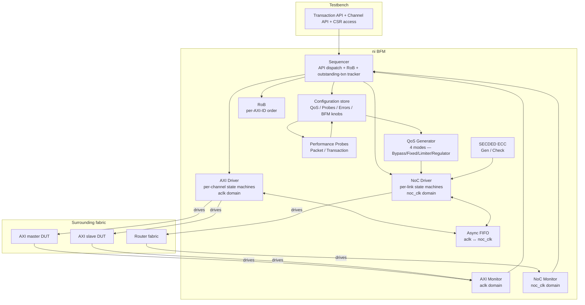
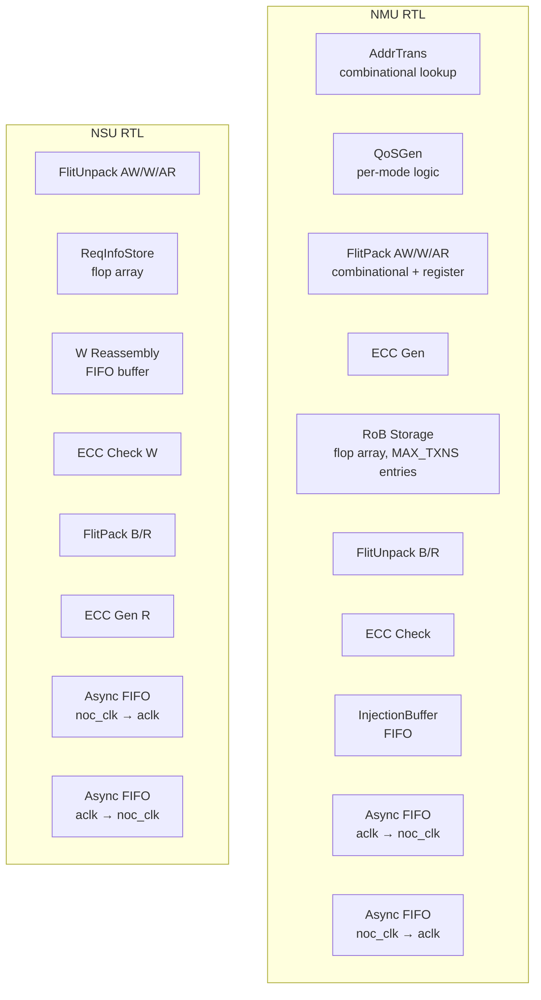

# Theory of Operation

## Block diagram

## BFM internal architecture

This section is **always required** in protocol-bfm mode.

### Driver

The BFM has **two driver instances** running in different clock domains:

- **AXI Driver** (in `aclk_i` domain): owns per-channel state machines for AW/W/B/AR/R on both manager port (`axi_in_*`) and subordinate port (`axi_out_*`). Plus AXI4-Lite state machine for the CSR port. Fully registered outputs.
- **NoC Driver** (in `noc_clk_i` domain): owns per-link state machines for `noc_req_o`, `noc_req_i.ready`, `noc_rsp_o`, `noc_rsp_i.ready`. Fully registered outputs.

Both drivers are disabled when `bfm_mode == PASSIVE`; outputs follow `pin_level_reset.md` during-reset values.

### Monitor

Two monitor instances, one per clock domain. Same activity in active and passive modes.

- **AXI Monitor**: samples all 5 channels of both AXI ports + CSR port. Reconstructs full AXI transactions. Reports violations per `protocol_rules.md` `AXI4_*` rules.
- **NoC Monitor**: samples both NoC links in both directions. Reconstructs full flit packets (header + payload). Validates ECC fields. Reports violations per `NOC_*` rules.

### Sequencer

Single sequencer instance (logically domain-spanning). Translates Transaction API calls into AXI Driver + NoC Driver activity, coordinated through:

- **Outstanding-transaction tracker**: per-AXI-ID; bounded by `MAX_TXNS` × `MAX_TXNS_PER_ID`.
- **RoB** (Reorder Buffer): see §RoB sub-block below.
- **CSR file** (in aclk domain): software-visible registers per `registers.md`. CSR writes to QoS / Probe / Error fields update the configuration store; reads return current state.
- **CDC orchestration**: cross-domain transactions (AXI → NoC → AXI) are tracked via correlated tracker entries spanning both domains; sequencer manages the lifecycle across the async FIFOs.

### Configuration store

Per-domain config state; both software-writable (via CSR) and testbench-API-writable (via `set_*` knobs):

| Field | Domain | Write source | Reset (wire) | Reset (state API) |
|-------|--------|--------------|--------------|-------------------|
| `QOS_MODE` (Bypass / Fixed / Limiter / Regulator) | aclk | CSR | preserved (CSR file resets to defaults at `arst_ni`) | preserved |
| `BANDWIDTH_LIMIT`, `SATURATION_THRESHOLD`, `LOW_PRIORITY` | aclk | CSR | reset to default | preserved |
| `BANDWIDTH_BUDGET`, `BASE_QOS`, `URGENCY_STEP`, `SOCKET_QOS_EN`, `SOCKET_QOS` | aclk | CSR | reset to default | preserved |
| `PKT_PROBE_EN`, `PKT_PROBE_MODE`, `PKT_WINDOW_SIZE` | aclk | CSR | reset | preserved |
| `TXN_PROBE_EN`, `TXN_THRESHOLD_*` | aclk | CSR | reset | preserved |
| `ERR_STATUS` (RW1C), `ERR_COUNT`, `ECC_UNCORR_ERR_CNT`, `LAST_ERR_INFO` | aclk | hardware writes; CSR write-1-to-clear by software | reset | preserved |
| `bfm_mode` (ACTIVE/PASSIVE) | testbench-only | `set_bfm_mode` | preserved | preserved |
| `set_response_delay_axi`, `set_response_delay_noc` | testbench-only | knob | preserved | reset to (0, 0) |
| ECC error injection one-shot, response fault one-shot | testbench-only | knob | reset | reset |

### Implementation-specific algorithms

#### QoS Generator

Per source-doc 06_qos.md §2 (4 modes):

- **Bypass**: `flit.hdr.qos = AXI awqos / arqos`
- **Fixed**: `flit.hdr.qos = QOS_FIXED_VALUE`
- **Limiter**: bandwidth_counter increments per request bytes, decrements per cycle by `BANDWIDTH_LIMIT`; when counter > `SATURATION_THRESHOLD`, qos becomes `LOW_PRIORITY`. Saturating arithmetic.
- **Regulator**: feedback loop on observed response bandwidth; bandwidth_counter accumulates response_bytes − `BANDWIDTH_BUDGET` per cycle; urgency_level adjusts per `URGENCY_STEP` per `BASE_QOS` register field; final qos = `clamp(BASE_QOS + urgency_level, SOCKET_QOS, 15)`.

QoS computed at AW/AR flit injection; W flit qos inherits from corresponding AW; response flit qos inherits from request (NSU's ReqInfoStore preserves it).

#### RoB allocator

Per source-doc 04_network_interface.md §FR-05. State machine: `FREE → ALLOCATED → RESPONSE_RECEIVED → READY_TO_RELEASE → FREE`. Per-AXI-ID release order enforced by linked-list of rob_idx within each ID's outstanding queue.

**RoB allocator policy when multiple FREE entries are available**: lowest-index-first allocation. Each NMU has a static priority encoder over its `MAX_TXNS`-entry RoB array; the lowest-numbered FREE entry is assigned to the next incoming AW or AR. Rationale: deterministic, matches typical ARM-style RoB implementations, simplifies coverage analysis. *Reviewer assumption: please confirm or override.*

**Tie-breaking when two RoB entries become READY_TO_RELEASE in the same cycle on the same `axi_id`**: release in `rob_idx` order (lower rob_idx releases first, reflecting the issue order from the per-AXI-ID linked list). The per-AXI-ID linked list is the canonical ordering source — when two entries on the same axi_id chain are simultaneously eligible, the one allocated first (lower rob_idx) wins. *Reviewer assumption: this matches standard AXI4 per-ID ordering semantics; please confirm.*

**RoB behavior when `rob_req = 0` in the flit header (i.e., master indicates it doesn't need RoB)**: NMU still allocates a tracker entry (to back-pressure on RoB-full), but releases responses immediately on receive without waiting for in-order release. Equivalent to "fast-path" / NoRoB-effective semantics for that transaction. *Reviewer assumption: confirm vs alternative (skip allocation entirely; degenerate stall).*

#### CDC (async FIFO)

NMU AXI ingress → NoC injection: aclk-domain producer, noc_clk-domain consumer. Gray-counter pointer + 2FF synchronizer. Default depth: 16 entries (sized to absorb 2× the maximum expected aclk-cycle round-trip at the slowest clock-ratio combination, plus 2 entries for synchroniser pipeline depth). *Reviewer assumption: 16 is conservative; tune down if area-critical.*

NMU NoC ingress → AXI egress: mirror direction.

NSU has analogous FIFOs in the inverse data flow.

#### ECC

Per source-doc §FR-06: SECDED Hsiao code, 8 ECC bits per 64-bit data granule, 4 granules per 256-bit DATA_WIDTH = 32-bit total ECC. NMU generates on W injection; NSU validates on W reception (writes `wecc[31:0]` field). NSU generates on R injection; NMU validates on R reception.

**Single-bit (correctable) errors**: NSU/NMU silently correct the granule and propagate corrected data downstream. A separate counter `ECC_CORR_ERR_CNT` (NEW; not in noc-sim source 06_qos.md §4.1, must be added) tracks corrected error events. The existing `ECC_UNCORR_ERR_CNT` tracks **only** double-bit (uncorrectable) events. *Reviewer assumption: ECC_CORR_ERR_CNT register at offset 0x110 (next free after LAST_ERR_INFO at 0x10C), saturating, RW1C clear via ERR_STATUS write-1 to a new bit position [2]. Confirm or relocate offset.*

**Multi-beat R response with one ECC error**: per-beat reporting. Only the affected beat carries `rresp=SLVERR` (per `AXI4_SLV_R_RRESP_ECC_FAIL` rule); other beats of the same burst have `rresp=OKAY`. This preserves throughput on partially-corrupted bursts and matches AXI4 per-beat resp semantics. *Reviewer assumption: matches AXI4 spec §A4.5; confirm.*

**ECC granule definition**: 64-bit data granule. For DATA_WIDTH=256, four granules. For DATA_WIDTH=512, eight granules. For DATA_WIDTH=128, two granules. For DATA_WIDTH=64, one granule. For DATA_WIDTH=32, the granule definition does not naturally fit; the BFM (and RTL) use a single 32-bit granule with appropriately-sized SECDED ECC (typically 7 bits for SEC, additional for DED). *Reviewer assumption: DATA_WIDTH=32 case may be excluded from initial deployment to avoid edge-case complexity.*

### Reset entry sequencing

1. Either (or both) of `arst_ni` / `noc_rst_ni` asserts asynchronously. All BFM outputs in the affected domain follow `pin_level_reset.md` during-reset values.
2. While the relevant reset is low: trackers in that domain dropped; pending `set_response_delay` countdowns cancelled; one-shot fault flags cleared; observation lists NOT cleared.
3. CDC FIFOs in the asserted domain hold reset values; FIFO read on the un-asserted side sees empty / FIFO write sees not-ready.
4. Reset deasserts → state machines remain IDLE; outputs transition to `pin_level_reset.md` after-reset values.
5. Cross-domain partial reset behavior: see `pin_level_reset.md` §Reset entry sequencing item 4.

### Performance commitments (BFM behavior model)

- **Throughput**: 1 AXI transaction per cycle (best case, no QoS regulation, no RoB back-pressure, no CDC stall).
- **Latency**: AXI AW handshake → noc_req_o injection: 1 cycle (`CUT_AX=0`) or 2 cycles (`CUT_AX=1`). NoC `noc_rsp_i` reception → AXI B handshake: same. Plus CDC traversal: ~3-4 cycles per direction depending on FIFO depth and clock ratio.
- **Resource model**: BFM tracks up to `MAX_TXNS` outstanding transactions; RoB depths per `B_ROB_SIZE` / `R_ROB_SIZE`.

## RTL internal architecture

`MODE.md` declares `has-rtl-counterpart: yes` — this NI has a paired RTL implementation, behaviorally equivalent at the AXI4 and NoC pin boundaries.

### RTL block structure

The RTL implementation follows the same external functional decomposition as the BFM (NMU + NSU + sub-modules per source-doc §2.2), but with synthesizable hardware modules instead of behavioral state machines:

Sub-modules:
- **AddrTrans (NMU)**: combinational; AXI awaddr / araddr → (dst_id, local_addr) per ROUTE_ALGO and USE_ID_TABLE config.
- **QoSGen (NMU)**: per-mode (Bypass / Fixed / Limiter / Regulator). Stateful for Limiter / Regulator (bandwidth_counter, urgency_level).
- **FlitPack / FlitUnpack**: combinational logic + 1 pipeline register; `CUT_AX` / `CUT_RSP` parameters add spill register.
- **RoB Storage (NMU)**: flop-based array of `MAX_TXNS` entries, each carrying state, axi_id, rob_idx, response data accumulator. Per-AXI-ID linked-list tracking.
- **Async FIFOs**: gray-counter pointer + 2FF synchronizer; depth synthesis-time parameter.
- **InjectionBuffer (NMU)**: small FIFO (`NMU_BUFFER_DEPTH` from `NocConfig`, default 2 in BFM). RTL uses the same default (2 entries) per BFM-RTL behavioral equivalence; *Reviewer assumption: confirm if RTL choice differs.*
- **ECC Gen / Check**: combinational; SECDED Hsiao per 64-bit granule.

### RTL pipeline / timing

- AXI handshake → flit injection: 1-2 cycles (`CUT_AX` parameter).
- NoC flit reception → AXI handshake: 1-2 cycles (`CUT_RSP` parameter).
- CDC traversal: 3-4 cycles each direction.
- RoB entry lifecycle: 1 cycle ALLOCATED → traffic round trip → 1 cycle to release.

Fixed timing (no runtime configurability beyond `CUT_AX` / `CUT_RSP` synthesis parameters). The BFM's `set_response_delay_*` knobs are testbench-only and have no RTL equivalent.

### RTL reset behavior

On `arst_ni` assertion:
- All AXI-domain registered outputs reset to `pin_level_reset.md` during-reset values.
- AXI in-flight tracker, RoB allocator state reset.
- AXI-domain configuration registers (CSR file) reset to defaults per registers.md (e.g., `QOS_MODE = 0` Bypass).
- CDC FIFO write-pointer (aclk side) reset; read-pointer on noc_clk side persists until `noc_rst_ni` asserts.

On `noc_rst_ni` assertion: mirror behavior.

Cross-domain partial reset → CDC FIFO is in inconsistent state; integrator must ensure both resets eventually deassert in the same power-on epoch.

### RTL-vs-BFM behavioral equivalence

| BFM feature | RTL counterpart |
|---|---|
| `set_response_delay_axi` / `set_response_delay_noc` | **Test-only.** RTL has fixed pipeline timing (`CUT_AX` / `CUT_RSP` synthesis params only). BFM knob exists for stress-testing master DUT response-latency tolerance. |
| `set_inject_ecc_error(channel, kind)` | **Test-only.** RTL only generates ECC errors when input data is genuinely corrupted (single-event upset, etc.). BFM knob exists for stress-testing downstream ECC-handling paths. |
| `set_response_fault(channel, SLVERR/DECERR)` | **Test-only.** RTL only generates SLVERR/DECERR on real conditions: ECC uncorrectable (W or R), AXI 4KB boundary crossing, unmapped address, RoB exhaustion timeout. |
| `bfm_mode = ACTIVE / PASSIVE` | **Test-only.** RTL is always active; PASSIVE is a verification convenience only. |
| `apply_axi_*` / `expect_axi_*` / `expect_noc_*` | **Test-only.** RTL is the DUT (in some scenarios) or the AXI responder (in others); it has no method API. |
| `get_observed_*` lists | **Test-only.** RTL has no observation buffers; observation happens via the BFM (in passive mode) or external scoreboards. |
| CSR-mapped QoS / Probe / Error registers | **Identical between BFM and RTL.** Software accesses the same CSR memory map (per `registers.md`). The BFM models the same CSR file; RTL implements it as actual flop-based registers. |
| ECC generation / validation | **Identical at the wire level.** Same SECDED Hsiao code; same per-granule layout. |
| RoB ordering | **Identical at the wire level.** Same per-AXI-ID order release; same back-pressure on `awready` / `arready` when full. |

### RTL implementation notes

- Synthesis target: ASIC 7nm process; target frequency 1.2 GHz on `noc_clk_i` and 800 MHz on `aclk_i`. *Reviewer assumption: representative target; adjust for actual deployment.*
- RoB Storage: flop-based at MAX_TXNS=32 (default); for larger MAX_TXNS, integrator should evaluate SRAM macro.
- CDC FIFO depth: parameter `CDC_FIFO_DEPTH`, default 16 entries.
- Lint exemption: `WIDTH_TRUNC` on AXI awaddr / araddr upper bits where the routing extracts only X_WIDTH+Y_WIDTH bits for dst_id (intentional). No other exemptions expected.

## AR-during-W ordering

When NMU has a W burst in flight on `noc_req_o`, may it inject an AR flit between W beats?

**Decision**: Yes. AR flits are single-cycle and may interleave with W burst beats on the same `noc_req_o` link. The router fabric does not assume W-burst contiguity at the NMU output; W-burst integrity is reconstructed at NSU's W-reassembly buffer using the flit `axi_ch=1` field plus per-NMU sequencing. AR flits carry `axi_ch=2` and are routed independently.

**Rationale**: separating AR from W at injection avoids head-of-line blocking when a slow remote slave back-pressures the W burst. The cost is slight increase in NSU complexity (W reassembly must tolerate interleaved AR observation), but this is implementation-internal and bounded.

*Reviewer assumption: confirm vs alternative (AR injection blocked until W burst completes — simpler at NSU but introduces HoL blocking).*

## ATOPs scope

AXI4 atomic operations (ATOPs) — single-token CAS / SWAP / LOAD-STORE — are **out of scope** for this NI revision. The `awatop` field is sampled and recorded for monitor mode but the BFM and RTL both terminate ATOPs with `bresp=SLVERR` and a single B response (no ATOP read-response generation).

*Reviewer assumption: matches noc-sim §3 parameter list which omits ATOP_SUPPORT. Confirm or upgrade to ATOP_SUPPORT=1 path (would add ~3 weeks of design + DV).*
