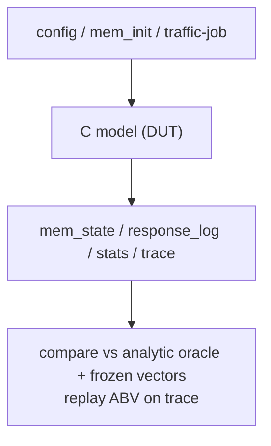
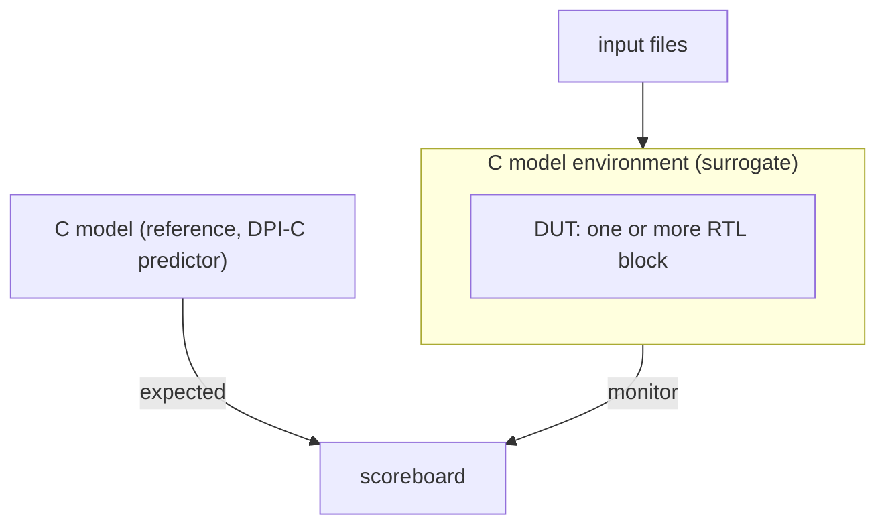
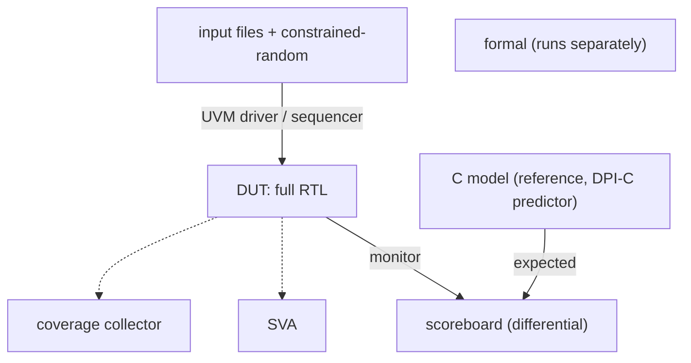

# Test Environment, Patterns & Verification Closure

本文件描述每個驗證 stage 的 test environment。每個 stage 一章，章節結構沿用 OpenTitan DV document template。跨階段共用的方法論、I/O 格式、OSS、closure 放在後段 §4 至 §11，各 stage 章節以引用方式連過去，不重複。著重設計與 OSS 運用，不含實作細節。Testpoint 與 coverage 清單見 `plan.md`。

---

## 0. 驗證階段總綱

整個專案的驗證分三個階段，由 C model 逐步交給 RTL。一套測試流量沿用全程，每個階段換的是 loop 內的 DUT 與 checker，流量格式不變。每個 stage 自己的 build 與 testbench infra 寫在該 stage 的 Testbench architecture 與 Building and running tests，不另立 infra 階段。

| 階段 | 受測對象 (DUT) | C model 角色 | 執行環境 | 測試核心 | 過關 (V-milestone) |
|---|---|---|---|---|---|
| **P1 C model validation** | C model（AXI 與 NoC 兩端）| **DUT** | Windows，C++ 加 GoogleTest | 單元測試、定點 microbench、合成流量 | C model readiness gate（見 §9.1）|
| **P2 RTL bring-up** | 一個或多個 RTL block | **reference model**（DPI-C predictor）| Linux 加 VCS | 沿用 P1 流量、directed test、時序校準 | RTL block 對 C 一致、時序容差內（V1 到 V2）|
| **P3 RTL signoff** | full RTL（NI 加 Router）| **reference model，保留** | Linux 加 VCS，UVM、SVA、formal | 合成流量、定點、constrained-random | coverage 100% 或 waiver、formal proven、soak（V3）|

**共用檔案契約**

輸入三類跨階段共用：config、mem_init.hex、traffic-job（text-job）。輸出四類跨階段共用：mem_state.hex、response_log、stats、trace。格式固定，見 §6。變的只有 DUT 與 checker。pattern 是貫穿三個 stage 的常數，infra 則各 stage 自有。P3 即使部分項目不靠 C model，仍輸出同一套檔案，方便回歸比對。

**貫穿全程的原則**

1. 同一套合成流量沿用 P1 到 P3，P3 另加 constrained-random。
2. 檢查方式逐階段轉移。P1 靠 analytic 公式與 frozen vectors，P2 與 P3 靠 C model reference 加 SVA 與 coverage。
3. C model 角色轉移。P1 是 DUT，P2 與 P3 是 reference model，保留到 signoff。

**本文件結構**

- §1 到 §3：每個 stage 一章，採 OpenTitan DV document 章節結構。
- §4 到 §11：跨階段 shared reference（方法論、stack、I/O 格式、流量產生、OSS、closure、術語、related），被各 stage 引用。

**層級說明**

本表是整個 NoC 系統層級的分階段，含 NI 與 Router。`plan.md` 是 NI 單元驗證，對應各 stage 的 NI 部分（P1 的 NI C-model、P2 的 NI block bring-up、P3 的 NI in full RTL）。

---

## 1. Stage P1: C model validation

**Goals**：驗證 C model 本身正確，讓它之後能當 reference model。

**Current status**：C model readiness gate。通過後 P2 與 P3 才可用它當 reference。判準見 §9.1。

**Design features**：涵蓋 C model 的 AXI 與 NoC 兩端功能與 cycle-level 行為。時序對 analytic 公式與設計意圖驗，尚未對 RTL 校準。不涵蓋 RTL。

**Testbench architecture**

- Block diagram：



- Top level testbench：Not applicable。GoogleTest 直接呼叫 C API，無 clock 或 reset wiring。
- Agents：Not applicable。無 protocol interface 被驅動，stimulus 經 C API 進入。
- UVM RAL Model：Not applicable。
- Reference models：本階段 C model 是 DUT，不是 reference。golden 來自 analytic 公式、hand-derived frozen vectors、ABV replay on C trace，見 §9.1。

**Stimulus strategy**

- Test sequences：directed 單元測試、定點 microbench、合成流量。格式見 §6，產生見 §7。
- Functional coverage：routing、ordering、ECC、traffic 場景矩陣。

**Self-checking strategy**

- Scoreboard：GoogleTest assertion 比對 C model 輸出與 analytic oracle 及 frozen vectors。
- Assertions：把 `plan.md` 的 FAIL ABV replay 在 C model trace 上，見 §9.1。

**Building and running tests**：input 是 config、mem_init.hex、traffic-job。output 是 mem_state.hex、response_log、stats、trace。在 Windows 純 C++ 跑，免模擬器。harness 是 GoogleTest，含 build 腳本與 smoke test。

**Testplan**：對應 `plan.md` 的 NI C-model 項目。過關是全測項通過，達 C model readiness gate（§9.1）。

---

## 2. Stage P2: RTL bring-up

**Goals**：用已取信的 C model 當 reference，先驗一個或多個 RTL block。

**Current status**：V1 到 V2。前提是 P1 已過 readiness gate。

**Design features**：涵蓋單一或部分 RTL block。NI block 看 AXI 與 flit 轉換、RoB、ECC、暫存器。Router block 看繞路、VC、credit、wormhole、仲裁。哪些 block 是 RTL 屬 composition 參數，不是不同方法論。時序從這裡開始對 RTL 校準，見 §9.3。

**Testbench architecture**

- Block diagram：



- Top level testbench：clock 與 reset、RTL block 連接、C model 經 DPI-C 綁入。
- Agents：SV driver 與 sequencer 驅動 DUT，是 stimulus boundary。monitor 觀測 DUT 輸出，是 observation boundary。
- UVM RAL Model：若該 block 含 CSR 存取則用，否則 Not applicable。
- Reference models：C model 經 DPI-C，同時當 reference model 與 environment surrogate，補上非 RTL 的 block。

**Stimulus strategy**

- Test sequences：沿用 P1 流量，由 C model 經 DPI-C 注入，directed corner 補強。
- Functional coverage：該 block 的 covergroups。

**Self-checking strategy**

- Scoreboard：RTL block 介面輸出對 C reference 比對。功能 byte-exact，時序在容差內。
- Assertions：該 block 的 SVA。

**Building and running tests**：input 與 output 檔同 P1，見 §6。在 Linux 加 VCS 跑，含該 stage 的 DPI-C bridge 與 build flow。

**Testplan**：對應 `plan.md` 的 block-level testpoint。過關是 RTL block 對 C 一致、時序容差內、block coverage 達 V2。

---

## 3. Stage P3: RTL signoff

**Goals**：full RTL 為 DUT，C model 保留當 reference，做最終收斂。

**Current status**：V3。

**Design features**：涵蓋 full RTL，含 NI 與 Router。加 constrained-random 衝覆蓋率。

**Testbench architecture**

- Block diagram：



- Top level testbench：full RTL 連接，C model 經 DPI-C 綁入當 predictor。
- Agents：SV driver 與 sequencer（含 constrained-random），monitor。
- UVM RAL Model：若有 CSR 則用。
- Reference models：C model 保留於 testbench。

**Stimulus strategy**

- Test sequences：合成流量、定點、constrained-random，見 §7。
- Functional coverage：full coverage model。

**Self-checking strategy**

- Scoreboard：differential，C reference 對 full RTL。data 與 response byte-exact，時序在 sync point 精確、整體用 correlation，見 §9.3。
- Assertions：full SVA。formal 另跑。

**Building and running tests**：input 與 output 檔同 P1，見 §6。在 Linux 加 VCS 跑，含 UVM、SVA、formal 與 nightly regression。

**Testplan**：對應 `plan.md` 全表。過關是 coverage 100% 或 waiver、formal proven、多 seed soak，達 V3，見 §9。部分項目如 local SVA、FPV、coverage-only regression 不需 reference model，此時 C model 可離線產 expected vectors。

---

## 4. 方法論

C model + RTL co-sim：高階 C model 驗效能，模型正確後當 reference model 與 RTL co-sim。Scope = NI + Router（整個 NoC）。C model 同時是 perf model 與 reference model。

對齊先例：BookSim2 與 gem5 Garnet（C++ NoC perf model），加 Spike 與 Ibex cosim（reference-model lockstep）。

---

## 5. Stack 與環境分工

SV stack（非 cocotb）：`plan.md` 已是 SV/UVM 形狀（每條 FAIL rule 一條 SVA、covergroups、FPV），VCS 是 SV/UVM/SVA/DPI-C 原生，可重用的 OSS 多為 SV。改 cocotb 等於重寫既有計畫。

| 環境 | 跑什麼 | 工具 | 需 VCS |
|---|---|---|---|
| Windows（本機）| C-model 開發 + C-model 自驗 tier-1（GoogleTest、routing/latency oracle、frozen golden vectors）| 純 C++ / GoogleTest | 否 |
| Windows（選配）| C↔RTL co-sim 快速 bring-up | Verilator（OSS，DPI-C/C++ 友善，SVA 有限、無 UVM）| 否 |
| Linux + VCS | RTL sim、co-sim（DPI-C）、SVA（FAIL ABV 跑 RTL 加 replay C-trace）、UVM/pulp axi_test、covergroups、formal | VCS + SV OSS + VC Formal / SymbiYosys | 是 |

同一組 ABV SVA 兼驗 C-model trace（replay）與 RTL（co-sim），單一 assertion 來源，兩條 trace。

---

## 6. I/O Pattern 格式（全 text，無 JSON）

一組 pattern = 3 input → model/RTL → 3 output。所有檔案皆為純文字或 hex，SV 端用 `$fscanf` / `$readmemh` 直讀，不需 JSON parser。

| # | 角色 | 格式 | 讀取方式 | golden 比對 |
|---|---|---|---|---|
| 1 | Config | SV `parameter` + `+plusargs`（runtime 旋鈕），C-model 用 text `key=value` | `$value$plusargs` / fstream | N/A |
| 2 | Memory init | `.hex`（`$readmemh` 格式）| `$readmemh` / C++ fstream | N/A |
| 3 | Traffic job | per-endpoint text-job（§6.1）| SV `$fscanf` / C++ fstream | N/A |
| 4 | Memory state | `.hex` | dump 比對 | byte-exact |
| 5 | Response log | text / CSV（每列一筆 txn）| 逐列比對 | data + resp-code exact |
| 6 | Stats | text / CSV | N/A | 不比對（derived）|

### 6.1 Traffic job 格式（text-job，採 FlooNoC `gen_jobs.py` / `tb_tasks.svh`）

每個 mesh endpoint 一個 `.txt`，每筆 transaction 依序：

```
<length-bytes>
<hex src_addr>          # src node 的 mem 區（addr 高位編碼 node_id）
<hex dst_addr>          # dst node 的 mem 區
<src_protocol>          # 0 = AXI
<dst_protocol>          # 0 = AXI
<max_src_burst_size>
<max_dst_burst_size>
<r_aw_decouple>         # 0/1
<r_w_decouple>          # 0/1
<num_errors>            # >0 時後接 per-error 描述列
```

範例（tile(1,1) 寫 2KB 到 tile(2,2)，node→addr = `(x*NUM_Y + y) * MEM_SIZE`，等同本專案 `dst_addr[39:32] = node_id`）：

```
2048
0x50000
0xa0000
0
0
256
256
0
0
0
```

Config 用 plusargs（如 FlooNoC 的 `+JOB_NAME` / `+JOB_DIR`）加 SV parameter，不用 JSON。memory init 用 `$readmemh` hex。response-log 與 stats 用 CSV，不用 JSON。

### 6.2 Spatial traffic pattern

決定各 endpoint 目的地分布的標準合成 pattern（出自 Dally & Towles《Principles and Practices of Interconnection Networks》與 BookSim、gem5 Garnet）：

`uniform · transpose · bit_complement · bit_reverse · bit_rotation · shuffle · tornado · neighbor · hotspot`（加 FlooNoC 的 `matmul` / `hbm`）。

---

## 7. Pattern 產生方式

Python 產生器：輸入 `(pattern_type, mesh 大小, injection_rate, N_txns, burst/size 分布)`，依 spatial pattern 算各 endpoint 目的地，吐 per-endpoint traffic-job 加 memory init。
範例（FlooNoC 介面）：`make jobs TRAFFIC_TYPE=transpose` 產 `mesh_0.txt` 到 `mesh_15.txt`。
C-model 讀 job 跑出 golden output，同一組餵 RTL co-sim 比對。

---

## 8. 可重用 OSS

| 需要 | 現有 code | 實際重用程度（落地） |
|---|---|---|
| Pattern 產生器（Python）| **FlooNoC `util/gen_jobs.py`** | fork/template：`NUM_X/NUM_Y/MEM_SIZE` 是腳本常數、無 `injection_rate` 排程、不產 memory init、burst/size 分布有限 |
| Spatial pattern 定義 | gen_jobs.py + **gem5 `garnet_synth_traffic.py`** | 抄定義（pattern 名稱加 destination function）|
| Text-job reader（SV）| **FlooNoC `tb_tasks.svh`** + **`floo_dma_test_node.sv`**（本機確認有，iDMA job-flow）| 改：是 iDMA-shaped job（含 n_dims strides），給 plain AXI 要調整 |
| AXI driver | **FlooNoC `floo_axi_test_node.sv`** = random AXI node（`axi_rand_master`，非 job-reader），file-driven 用 **pulp `axi_file_master`** | 當 random driver 模板，逐 job replay 的 sequencer 要自寫或接 `axi_file_master` |
| AXI slave / memory model | pulp `axi_test::axi_rand_slave` / FlooNoC `floo_axi_rand_slave.sv` | 直接用（AXI 層）|
| Memory init 讀取 | `$readmemh` / C++ fstream | 標準，直接用 |
| Ordering 檢查 | **FlooNoC `axi_reorder_compare.sv`** / pulp `axi_scoreboard` | 只覆蓋 same-ID ordering 加 AXI 欄位，不懂 flit/ECC/route_par/QoS/CSR/memory，非 full golden |
| ECC encode/decode | **OpenTitan `secded_gen.py`** | 需 fork/extend：原 script 限 `k≤120`，whole-flit 約 396-bit 超過，需放寬加固定 H-matrix 加產 RTL/C 同源 |
| Formal | **SymbiYosys + Yosys**（OSS）或 VCS VC Formal | 只適合小型抽取目標（credit counter、arbiter、small FIFO、ECC logic），full NI+Router deadlock-freedom 需抽象 CDG proof 或商用 formal |
| Closure / testplan | **OpenTitan `dvsim` / testplanner** | 需導入流程：寫 hjson cfg、coverage merge adapter、dashboard |
| Network 層 perf baseline | **BookSim2 / gem5 Garnet**（cycle-accurate，僅 network/flit 層）| network-layer differential，非 AXI golden，見 §6.2 與 §9.3 |

自寫部分（不是只對映欄位）：job sequencer（逐 job replay）、C/RTL trace adapter（給 ABV replay 與 timing 比對）、AXI↔flit scoreboard（flit/ECC/QoS/CSR/memory，OSS 不覆蓋）、timing microbench harness（§9.3）。OSS 提供 stimulus、AXI VIP、ordering check、ECC gen、formal 工具、pattern 定義的材料，整合與 NoC-specific 檢查仍需自建。

---

## 9. 可信收斂（Verification Closure）

採 OpenTitan V1/V2/V3 stage gate，非只看 coverage 數字：

| Stage | 收斂定義 |
|---|---|
| V1 | 每 feature 有 testpoint + checker + coverage item + TB/scoreboard/assertion skeleton，smoke pass，nightly regression setup |
| V2 | functional coverage 至少 90% 且全實作，所有 assertion 寫好，end-to-end scoreboard enabled，P0/P1 bug 關閉 |
| V3 | coverage 100%（或 review 過 waiver），formal/assertion 100% proven，多 seed soak 至少 1 week 全過，無未解釋 waiver |

### 9.1 命門：C-model 自身正確度（對應 P1，先做，否則 co-sim 循環論證）

C-model 當 reference 前必須獨立取信。C 與 RTL 不一致時，co-sim 不會告訴你誰對。本專案資產足夠，多為接線：

1. 把 `plan.md` 已規劃的 FAIL ABV SVA replay 在 C-model 自己的 signal trace 上，C-model 自證 protocol 合規，不依賴 RTL。
2. XY 公式當 routing oracle：all-pairs sweep 比對 realized hop 序列。
3. analytic zero-load latency 當 perf oracle：C 必須 ±0 match（hops × pipeline depth + NI +1）。
4. frozen hand-derived golden vectors 入 `patterns/`，破 capture-at-source 的搬運恆等式循環。
5. RoB 與 ECC 的 FPV proof（`plan.md` 已 scope）。

C-model sign-off 等於上述全過。

### 9.2 逐子項目收斂判準

| 子項目 | 收斂判準 | 工具 / 資產 | OT stage |
|---|---|---|---|
| C-model 自正確 | ABV 過 C-trace + frozen 向量 + XY/latency oracle + RoB/ECC FPV | 既有 ABV/FPV 加公式 oracle | V1 到 V3 |
| C↔RTL equivalence | data/resp/memory byte-exact + ABV 過兩 trace + bin-closure 0 mismatch | 既有 co-sim 加 ABV | V2 到 V3 |
| AXI compliance | rule→SVA→TP→bin traceability 0 orphan，解掉所有 `(unverified)` | pulp axi_test / AMD AXI checker | V1 到 V3 |
| AXI ordering / RoB | FPV proof（非 bounded-cex）per-ID order==issue order + `cg_rob_state_machine` 100% | 既有 FPV、FlooNoC axi_reorder_compare | V2/V3 |
| Routing | all-pairs realized hop == XY analytic | XY 公式 oracle | V2 |
| Credit conservation | 不變量升 always-on SVA，regression 0 violation | SymbiYosys | V2/formal V3 |
| Deadlock freedom | acyclic CDG/VC 證明 + FPV arbiter liveness + per-txn completion watchdog（非 threshold heuristic）| VC Formal / SymbiYosys | V2 分析/V3 formal |
| Wormhole | always-on SVA：first-grant→last=1 無異包 flit、vc_id 不變 | SVA | V2/V3 |
| ECC | exhaustive single-bit FPV + double-bit 取樣數明寫 + `cg_ecc` 100% | secded_gen | V2/V3 |
| Performance | zero-load ±0 vs analytic + saturation curve + loaded ±5% vs RTL | BookSim2/Garnet baseline | V2/V3 |
| Cycle-accuracy | 見 §9.3（時序軸）| directed microbench 加 RTL 校準 | V3 selected configs |

### 9.3 時序軸收斂（cycle-accuracy calibration，對應 P2、P3）

§9.1 與 §9.2 多屬功能軸（C model 當 reference，用 oracle 取信）。cycle-accurate C model 的時序不能自證。RTL 是時序真值，且不該追「所有 cycle 微狀態的高覆蓋」（buffer × arb × credit × VC × pipeline 狀態爆炸，且無獨立 cycle golden，會循環）。時序收斂改用 directed microbench 對 RTL 校準。

Trace schema（每 cycle 記錄，供 ABV replay 與 timing 比對）：AXI handshakes、NoC valid/ready/credit、flit header、router input/output grant、vc_id、wormhole lock、RR pointer、queue depth、RoB state、CDC FIFO observable events。

Microbench suite（每筆定義 stimulus、觀測點、期望 cycle、容差、覆蓋 class）：zero-load single flit、multi-hop XY、W-burst wormhole lock、AR blocked during W、same-cycle AW/AR RR tie、VC contention、credit starvation/recovery、RoB full/backpressure、same-ID reorder release、QoS no-preempt、CDC ratio 1:1 / 2:1 / 1:2。

容差分級：single-clock deterministic path = ±0。CDC crossing = 明確 phase-dependent envelope。loaded aggregate latency/throughput = ±5%（perf correlation，非 cycle-exact equivalence）。

時序軸「高覆蓋」的定義是 structural / microbenchmark / contention-scenario-class coverage（每個 `*_DELAY` knob 各被獨立驗、每類 contention 場景被覆蓋），不是 random 撞 cycle microstates。

Network-layer differential（BookSim2 / Garnet，唯一的時序獨立交叉檢查）：剝掉 AXI，用同一 topology 加 synthetic traffic，比 router/link/VC/credit 子系統的 hop latency、saturation、latency curve。比較時分離 NI overhead（pack/unpack、`CUT_AX`/`CUT_RSP`、CDC、RoB release）。僅 network/flit 層，不含 AXI/NI/memory，故不可作端到端 golden。

---

## 10. 術語與 OSS 先例對映

本方法論的標準術語（非自創）：`co-simulation`、`lockstep / step-and-compare`、`differential testing`、`directed / synthetic microbenchmark validation`、`trace-based validation`、`calibration / correlation`、`golden / reference model checking`、`regression`。Verification 是符合 spec，Validation 是符合現實/RTL（perf 對得上）。本方法論兩者都做。

本設計是 hybrid（cycle-accurate NoC perf model 又當 RTL reference），無單一 OSS 全等。按軸對映先例：

| 軸 | 先例 | 借用 | 差異 |
|---|---|---|---|
| 功能 reference + RTL co-sim 結構 | **Ibex / Spike lockstep** | reference 與 RTL 在明確同步點（transaction 完成 / 介面事件，非每內部 cycle）differential | Spike 是功能 ISS、無 timing |
| reference 自身取信（無外部 golden）| **Spike 取信法** | 靠 spec（`protocol_rules`）衍生 ABV + analytic oracle + frozen vectors，見 §9.1 | DRAMSim 有 vendor golden，本設計沒有，更靠 spec-derived |
| timing / perf fidelity | **gem5 Garnet** | synthetic traffic + latency-throughput curve + correlation，見 §9.3 | Garnet 不做 RTL-reference co-sim、不模 AXI |
| 介面 per-cycle 協定合法性（AXI handshake / credit / VC）| **DRAMSim / Ramulator trace-to-RTL** | C model 產 trace，replay 過 RTL 檢查介面合法 | DRAMSim 信 RTL 驗 C（方向相反）|

定位句：以 spec-derived oracle/ABV 取信的 cycle-accurate NoC C++ reference model，與 RTL 做 differential co-simulation。功能在 transaction 與介面同步點 cycle-exact 比對，bulk timing 用 synthetic-traffic latency-throughput correlation 校準。

OSS 是否真追 cycle-exact：多數（gem5、Garnet、BookSim、Noxim）不追全系統 cycle-exact，只驗 latency-throughput fidelity。僅在介面協定逐 cycle contract（AXI handshake、credit/VC）才 cycle-exact，bulk 用 correlation。本設計的容差分級（§9.3）即依此。

必讀：Ibex cosim docs（co-sim 結構，硬體 DV 最易上手），接 gem5 Garnet（NoC timing 驗證），接 DRAMSim2 paper（trace-to-RTL 介面技術）。

---

## 11. Related

- `plan.md`：testpoints、coverage model、ABV-FPV 清單。
- `../doc/02_flit.md`：flit 格式（pattern 的 wire-level 對應）。
- 系統級 C-model 平台與 co-sim 機制：noc-sim `docs/design/08_simulation.md`、`09_verification.md`。
